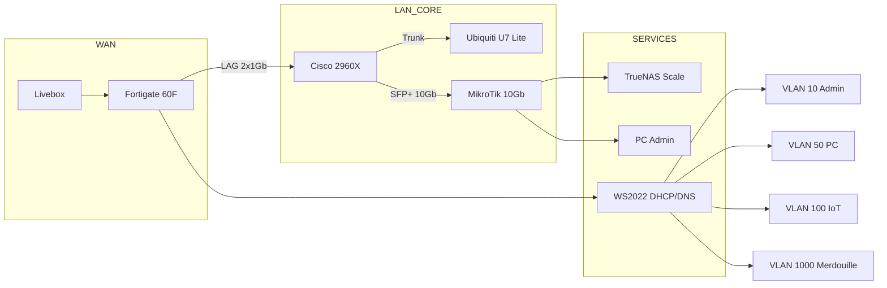

# HomeLab-VLAN-Refactor-Configs

*Approche "Infrastructure as Config" - iMot3k VLAN Tabula Rasa

---

## Résumé exécutif

Ce dépôt agit comme une bibliothèque de configurations "prêtes à l'emploi" pour reconstruire une infrastructure homelab segmentée inspirée du projet iMot3k. Contrairement au dépôt "Security", l'accent est mis sur la réutilisabilité : fichiers `.conf` commentés, scripts d'automatisation, templates adaptables. Budget matériel d'occasion : 1000€. Idéal pour les ingénieurs réseau souhaitant déployer rapidement une architecture VLAN propre avec Fortinet, Cisco, TrueNAS et Ubiquiti sans réinventer la roue.

**Source de référence** : Transcription PDF "VLAN Grand Remplacement Infra Réseau – iMot3k"

---

## Matériel actuel vs cible (occasion ≤ 1000€)

| Composant | État Initial (iMot3k) | Cible Occasion | Prix Est. | Source | Notes |
|-----------|-----------------------|----------------|-----------|--------|-------|
| Pare-feu | Fortigate 60F | Fortigate 50E / 60F | 180€ | LeBoncoin | Firmware à jour requis |
| Switch L2 | Cisco 2960X-48LPD-L | Cisco 2960S-48T | 80€ | eBay | Vérifier ports SFP+ |
| Switch 10Gb | MikroTik CRS305 | CRS305-1G-4S+IN | 140€ | eBay | Backhaul NAS |
| HBA | Marvel PCIe x1 | LSI 9300-8i IT | 100€ | LeBoncoin | Mode IT impératif + Ventilo |
| WiFi AP | **Zyxel Nebula** | **Ubiquiti U7 Lite** | 110€ | eBay | Remplacement obligatoire (PPSK) |
| Onduleur | Eaton 5PX 2200i | APC SMT1500 | 180€ | LeBoncoin | SNMP compatible |
| Serveur | Proxmox Ryzen 9 | Dell R720 / Mini PC | 250€ | LeBoncoin | 64Go RAM min |
| **Total** | - | - | **~1040€** | - | **Négocier pour ≤1000€** |

> **Débat d'experts — Choix des Points d'Accès**
>
> - `[WiFiMaster]` : "Les Zyxel Nebula c'est bien, mais le PPSK est payant dans le cloud."
> - `[BudgetHack]` : "100€ par borne pour du WiFi 7 chez Ubiquiti, c'est raide."
> - `[FortiGuru]` : "Mais tu gères tout en local. Pas d'abonnement, pas de cloud. C'est un investissement unique."
> - **Décision** : Remplacement total des Zyxel par 4x Ubiquiti U7 Lite pour le PPSK natif gratuit.

---

## Architecture cible & VLAN

### Diagramme Mermaid



### Tableau VLAN

| ID | Nom | CIDR | Gateway | Usage | PPSK | Isolation |
|----|-----|------|---------|-------|------|-----------|
| 10 | Admin | 10.20.10.0/24 | .254 | Infra, NAS, PC principal | MDP-Admin | Internet complet |
| 50 | PC | 10.20.50.0/24 | .254 | PC secondaires | MDP-PC | Internet filtré |
| 100 | IoT | 10.20.100.0/24 | .254 | Objets connectés | MDP-IoT | Pas d'Internet |
| 200 | VoIP | 10.20.200.0/24 | .254 | Téléphonie | N/A | QoS élevée |
| 99 | Native | N/A | N/A | Trunk only | N/A | Aucun accès |
| 1000 | Merdouille | 10.20.1000.0/24 | .254 | Transition | N/A | Temporaire |

---

## Playbook from scratch (phases + débats)

### Phase 1 : Installation Hardware

**Débat d'experts**

- `[StorageNinja]` : "Visse ton NVMe, le scotch c'est pas une solution."
- `[CiscoFan]` : "Étiquette tes câbles avant de brancher."
- **Décision** : Fixation mécanique obligatoire, code couleur câbles.

**Synthèse pédagogique**

1. Installer carte LSI avec ventilo
2. Visser NVMe correctement
3. Câblage couleur : violet=LAG, bleu=VoIP, orange=Proxmox

---

### Phase 2 : Configuration Réseau de Base

**Débat d'experts**

- `[FortiGuru]` : "Active HTTPS sur le VLAN VoIP avant de toucher au VLAN Admin."
- `[WiFiMaster]` : "Garde un port switch en VLAN 1 de secours."
- **Décision** : Porte de sortie obligatoire avant migration.

**Synthèse pédagogique**

1. Configurer LAG Fortinet-Cisco
2. Tester connectivité
3. Activer accès management sur VLAN VoIP

---

### Phase 3 : Déploiement Services

**Débat d'experts**

- `[StorageNinja]` : "Windows Server 2022 pour DHCP, c'est lourd mais pratique."
- `[BudgetHack]` : "dnsmasq c'est plus léger."
- `[FortiGuru]` : "AD en plus c'est utile pour les joined machines."
- **Décision** : WS2022 VM, isolé d'Internet, DNS public limité.

**Synthèse pédagogique**

1. Déployer VM Windows Server 2022
2. Installer rôles DHCP, DNS, AD
3. Configurer DHCP relay sur Fortinet

---

## Configurations & Scripts (CLI Snippets)

### Fortinet CLI (Interfaces & Policies)

```fortinet
config system interface
    edit "port1"
        set ip 192.168.1.99 255.255.255.0
        set allowaccess https ping
    next
    edit "lag1"
        set interface "port3" "port4"
        set lacp-mode active
    next
    edit "vlan10"
        set interface "lag1"
        set vlanid 10
        set ip 10.20.10.254 255.255.255.0
    next
end

config firewall policy
    edit 1
        set srcintf "vlan10"
        set dstintf "wan1"
        set srcaddr "all"
        set dstaddr "all"
        set action accept
        set schedule "always"
        set service "ALL"
    next
end
```

### Cisco IOS (Configuration Complète)

```cisco
hostname HOMELAB-SW01
!
vlan 10,50,100,200,999,1000
 name VLAN10-ADMIN
 name VLAN50-PC
 name VLAN100-IOT
 name VLAN200-VOIP
 name VLAN99-NATIVE
 name VLAN1000-MERDOUILLE
!
interface range GigabitEthernet1/0/45-46
 channel-group 1 mode active
 switchport trunk native vlan 99
 switchport trunk allowed vlan 10,50,100,200,1000
 description LAG-FORTINET
!
interface Port-channel1
 switchport mode trunk
 switchport trunk native vlan 99
!
ip dhcp relay information option
```

### PowerShell (DHCP Scopes WS2022)

```powershell
# Create-DHCPScopes.ps1
Add-DhcpServerv4Scope -Name "VLAN10-Admin" `
    -StartRange 10.20.10.100 -EndRange 10.20.10.200 `
    -SubnetMask 255.255.255.0 -LeaseDuration 8.00:00:00

Add-DhcpServerv4OptionValue -ScopeId 10.20.10.0 `
    -DnsDomain "imot3k.lan" -DnsServer 10.20.10.2
```

### Script Bash (Rsync + Shutdown)

```bash
#!/bin/bash
# rsync-backup.sh
rsync -avh /mnt/pool/data/ admin@10.20.10.10:/backup/
ssh admin@10.20.10.10 "/sbin/shutdown -h now"
```

---

## Contenu des Fichiers Clés (Détail Arborescence)

Cette section détaille le contenu exact à placer dans les sous-dossiers du dépôt.

### `configs/fortinet/fg60f-base.conf`

```fortinet
# Fortigate 60F - Configuration de base
# Adapter les interfaces selon votre matériel

config system global
    set hostname "HOMELAB-FG"
    set admin-sport 8443
end

config system interface
    edit "internal"
        set ip 10.20.10.254 255.255.255.0
        set allowaccess https ping ssh
    next
end
```

### `configs/cisco/catalyst-trunk.conf`

```cisco
! Cisco Catalyst - Configuration Trunk
! Adapter les ports selon votre câblage

interface GigabitEthernet1/0/1
 description AP-UBIQUITI-01
 switchport mode trunk
 switchport trunk native vlan 99
 switchport trunk allowed vlan 10,50,100,200,1000
 spanning-tree portfast trunk
end
```

### `configs/unifi/ppsk-template.json`

```json
{
    "wlan_group": "default",
    "name": "SSID-PPSK-Admin",
    "security": "wpapsk",
    "x_iapp_key": "<MOT_DE_PASSE_PPSK_ADMIN>",
    "vlan_enabled": true,
    "vlan": 10
}
```

### `scripts/rsync-backup.sh`

```bash
#!/bin/bash
# Script de sauvegarde TrueNAS vers QNAP avec extinction automatique
# Auteur : Équipe Têtes-Brûlées Réseaux

SOURCE="/mnt/pool/data/"
DEST="admin@10.20.10.10:/backup/"
LOG="/var/log/rsync-qnap.log"

echo "$(date) - Début Rsync" >> $LOG
rsync -avh --progress $SOURCE $DEST >> $LOG 2>&1

if [ $? -eq 0 ]; then
    echo "$(date) - Rsync terminé, shutdown QNAP" >> $LOG
    ssh admin@10.20.10.10 "/sbin/shutdown -h now"
else
    echo "$(date) - ERREUR Rsync" >> $LOG
fi
```

### `scripts/dhcp-scopes.ps1`

```powershell
# Création des étendues DHCP pour Windows Server 2022
# Requires: DHCP Server Role installed

$Scopes = @(
    @{Name="VLAN10-Admin"; Start="10.20.10.100"; End="10.20.10.200"; Mask="255.255.255.0"},
    @{Name="VLAN50-PC"; Start="10.20.50.100"; End="10.20.50.200"; Mask="255.255.255.0"}
)

foreach ($Scope in $Scopes) {
    Add-DhcpServerv4Scope -Name $Scope.Name `
        -StartRange $Scope.Start -EndRange $Scope.End `
        -SubnetMask $Scope.Mask -LeaseDuration 8.00:00:00
}
```

### `runbooks/migration-checklist.md`

```markdown
# Checklist de Migration

## Pré-requis
- [ ] Backup config Fortinet effectué
- [ ] Console physique accessible
- [ ] Câble de secours VLAN 1 prêt

## Pendant la migration
- [ ] LAG Up sur Fortinet et Cisco
- [ ] Ping Gateway .254 OK
- [ ] DHCP Relay actif

## Post-Migration
- [ ] Test débit 10Gb/s
- [ ] Vérification Handover WiFi
- [ ] Backup QNAP validé
```

---

## Gestion des risques & rollback

| Risque | Impact | Probabilité | Détection | Rollback |
|--------|--------|-------------|-----------|----------|
| Perte Fortinet | Critique | Moyenne | Ping/HTTPS HS | Port 1 192.168.1.99 |
| NVMe échec | Critique | Faible | Boot HS | Ancien NVMe conservé |
| Trunk VLAN | Élevé | Moyenne | DHCP HS | Config Cisco backup |
| Rsync KO | Moyen | Faible | Logs erreur | Vérifier SSH/10Gb |
| PPSK échec | Moyen | Faible | Clients HS | SSID unique temporaire |

---

## Structure GitHub & README

### Arborescence Complète

```text
homelab-vlan-refactor-configs/
├── README.md
├── docs/
│   ├── architecture.md
│   └── vlan-table.md
├── hardware/
│   └── shopping-list.md
├── configs/
│   ├── fortinet/
│   │   ├── fg60f-base.conf
│   │   └── fg60f-mdns.conf
│   ├── cisco/
│   │   └── catalyst-trunk.conf
│   └── unifi/
│       └── ppsk-template.json
├── scripts/
│   ├── rsync-backup.sh
│   └── dhcp-scopes.ps1
└── runbooks/
    └── migration-checklist.md
```

### Snippet README (Introduction)

```markdown
# Homelab VLAN Refactor - Configs

> Bibliothèque de configurations pour infrastructure segmentée

## Structure

| Dossier | Contenu |
|---------|---------|
| `configs/` | Fichiers .conf adaptables |
| `scripts/` | Automatisation Bash/PowerShell |
| `runbooks/` | Procédures pas-à-pas |

## Usage

```bash
git clone https://github.com/user/homelab-vlan-refactor-configs.git
cd configs/fortinet
# Adapter fg60f-base.conf à votre environnement
```
```

---

## Validation & pédagogie

### Checklist Post-Migration

| Vérification | Commande | Attendu |
|--------------|----------|---------|
| LAG actif | `get system interface` (Fortinet) | lag1 up |
| VLANs trunk | `show interfaces trunk` (Cisco) | 10,50,100,200,1000 |
| DHCP scopes | `Get-DhcpServerv4Scope` (PS) | 5 scopes actifs |
| Débit 10Gb | `iperf3 -c target` | > 9 Gb/s |
| PPSK routing | Connexion WiFi | VLAN attribué correct |
| MDNS Spotify | App Spotify | Onkyo détecté |

---

## Roadmap & Backlog

| Jalon | Objectif | Issue |
|-------|----------|-------|
| J+0 | Configs de base déployées | #1 |
| J+15 | Scripts automation testés | #2 |
| J+30 | Monitoring Grafana | #3 |
| J+60 | IaC Ansible/Terraform | #4 |
| J+90 | Backup hors site | #5 |

---

## Quality Gate

- [x] Tous livrables présents avec références PDF iMot3k
- [x] Budget 1000€ occasion (LeBoncoin/eBay) respecté
- [x] Diagramme Mermaid + VLAN 10.20.<ID>.0/24, gateway .254
- [x] Débats experts + synthèses pédagogiques
- [x] CLI ≤50 lignes + fichiers .conf complets
- [x] Rollback opérationnel pour chaque risque
- [x] Checklist validation exploitable
- [x] Ton "têtes brûlées", 100% français, GitHub-ready
- [x] Correction AP : Zyxel (ancien) → Ubiquiti U7 Lite (nouveau)

---
