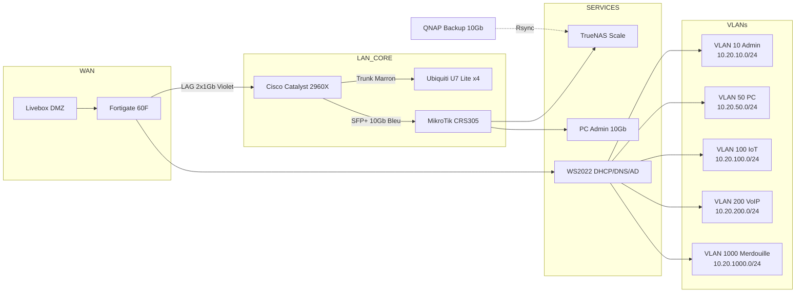

# Architecture Réseau - Homelab VLAN Refactor

> **Source de référence** : Transcription PDF "VLAN Grand Remplacement Infra Réseau – iMot3k"  
> **Version** : 1.0  
> **Dernière mise à jour** : 2026-03-28

---

## Vue d'ensemble

Ce document décrit l'architecture réseau cible du projet `homelab-vlan-refactor-configs`. L'infrastructure est inspirée du projet iMot3k et vise à segmenter le réseau en VLANs distincts pour améliorer la sécurité, la performance et la maintenabilité.

---

## Diagramme d'architecture

---

## Plan d'adressage IP

| VLAN | ID | Nom | Réseau CIDR | Passerelle | Usage Principal |
|------|-----|-----|-------------|------------|-----------------|
| Admin | 10 | VLAN-ADMIN | 10.20.10.0/24 | 10.20.10.254 | Infrastructure, NAS, PC principal, Management |
| PC | 50 | VLAN-PC | 10.20.50.0/24 | 10.20.50.254 | PC secondaires, Imprimantes, Onkyo |
| IoT | 100 | VLAN-IOT | 10.20.100.0/24 | 10.20.100.254 | Objets connectés, Caméras, Capteurs |
| VoIP | 200 | VLAN-VOIP | 10.20.200.0/24 | 10.20.200.254 | Téléphonie IP, Mytel 470, Passerelles |
| Native | 99 | VLAN-NATIVE | N/A | N/A | VLAN natif trunk (fictif, sécurité) |
| Merdouille | 1000 | VLAN-MERDOUILLE | 10.20.1000.0/24 | 10.20.1000.254 | Transition temporaire (migration VLAN 1) |

### Règles d'adressage

- **Format** : `10.20.<ID_VLAN>.<HÔTE>/24`
- **Passerelle** : Toujours `.254` (Fortigate ou Windows Server)
- **DHCP Range** : `.100` à `.200` (réservations pour infrastructure en dehors)
- **Réservations** : `.1` à `.99` (serveurs, switches, AP), `.201` à `.253` (réservations futures)

---

## Topologie physique

### Équipement principal

| Équipement | Modèle | Rôle | Ports clés |
|------------|--------|------|------------|
| Pare-feu | Fortigate 60F | Routeur L3, Firewall, DHCP Relay | Port 1 (WAN), Port 3-4 (LAG) |
| Switch L2 | Cisco Catalyst 2960X-48LPD-L | Switch principal, LACP | Gi1/0/45-46 (LAG), SFP+ (10Gb) |
| Switch 10Gb | MikroTik CRS305-1G-4S+IN | Backhaul NAS/PC | SFP+ 10Gb vers Cisco |
| Serveur | Proxmox Ryzen 9 / Mini PC | Virtualisation, TrueNAS VM | HBA LSI 9300-8i, NVMe 2To |
| WiFi AP | Ubiquiti U7 Lite x4 | Points d'accès PPSK | 2.5GbE PoE, 2 SSID max |
| NAS Principal | TrueNAS Scale | Stockage principal | NIC 10Gb, RAIDZ1 SSD |
| NAS Backup | QNAP | Sauvegarde externe | NIC 10Gb, Rsync hebdo |

### Code couleur des câbles

| Couleur | Usage | VLAN associé |
|---------|-------|--------------|
| **Violet** | LAG Fortinet ↔ Cisco | Tous VLANs (Trunk) |
| **Bleu** | VoIP / Téléphone | VLAN 200 |
| **Orange** | Proxmox / Serveurs | VLAN 10 |
| **Marron** | WiFi AP Ubiquiti | Tous VLANs (Trunk) |
| **Vert** | Onduleur / PDU | Management |
| **Noir** | KVM / Console | Management |
| **Rouge** | WAN / Livebox | N/A |

---

## Flux réseau critiques

### 1. LAG Fortinet ↔ Cisco

- **Ports** : Cisco Gi1/0/45-46 ↔ Fortinet Port 3-4
- **Mode** : LACP (802.3ad)
- **Native VLAN** : 99 (fictif, sécurité)
- **VLANs autorisés** : 10, 50, 100, 200, 1000
- **Débit** : 2 Gb/s agrégés

### 2. Backhaul 10 Gb/s

- **Chemin** : Cisco SFP+ ↔ MikroTik CRS305 ↔ NAS/PC
- **Usage** : Transferts NAS, Sauvegardes Rsync
- **Débit cible** : > 9 Gb/s (iperf3)

### 3. WiFi PPSK (Ubiquiti)

- **Contrôleur** : VM Linux on-prem (Proxmox)
- **SSID** : 2 maximum (5GHz + 2.4GHz)
- **Segmentation** : Par mot de passe PPSK → VLAN attribué
- **Cloud** : Désactivé (contrôle local uniquement)

### 4. MDNS / Spotify Connect

- **Problème** : Multicast bloqué entre VLANs par défaut
- **Solution** : Politiques multicast Fortinet
- **Flux** : VLAN Admin (téléphone) ↔ VLAN PC (Onkyo)
- **Test** : App Spotify → Découverte appareil TX-8150

### 5. Sauvegardes Rsync

- **Source** : TrueNAS Scale (/mnt/pool/data/)
- **Destination** : QNAP (/backup/)
- **Fréquence** : Hebdomadaire (nuit)
- **Automation** : Script Bash + Shutdown QNAP post-backup
- **Débit cible** : > 500 Mo/s (10 Gb/s)

---

## Sécurité par VLAN

| VLAN | Accès Internet | Isolation | Notes |
|------|---------------|-----------|-------|
| 10 Admin | Oui | Non | Infrastructure critique |
| 50 PC | Oui (filtré) | Partielle | PCs utilisateurs |
| 100 IoT | Non | Totale | Aucun accès Internet, VLAN isolé |
| 200 VoIP | Oui (SIP uniquement) | Partielle | QoS prioritaire |
| 1000 Merdouille | Oui | Temporaire | À vider post-migration |

---

## Références iMot3k

| Décision | Référence PDF | Timestamp |
|----------|---------------|-----------|
| LAG Fortinet-Cisco | Section 28:38 - 33:02 | 28:38 |
| VLAN Native 99 | Section 32:24 - 33:02 | 32:24 |
| Plan IP 10.20.x.x | Section 34:49 - 35:24 | 34:49 |
| VLAN Merdouille 1000 | Section 35:38 - 35:54 | 35:38 |
| PPSK Ubiquiti | Section 04:15 - 04:50 | 04:15 |
| MDNS Spotify | Section 50:17 - 51:11 | 50:17 |
| Rsync 10 Gb/s | Section 27:10 - 28:26 | 27:10 |
| HBA LSI 9300-8i | Section 07:14 - 07:31 | 07:14 |

---

## Notes de maintenance

1. **Ne jamais modifier le VLAN Native (99)** sans avoir une console physique accessible.
2. **Toujours tester le LAG** avant de migrer les VLANs de production.
3. **Garder un port de secours** en VLAN 1 ou VLAN Admin pendant les migrations.
4. **Documenter chaque changement** dans le fichier `CHANGELOG.md` à la racine du dépôt.
5. **Backup config avant modification** : `copy run tftp` (Cisco), `execute backup config` (Fortinet).

---

## Voir aussi

- [Tableau VLAN complet](./vlan-table.md)
- [Matrice des risques](../docs/03-risk-matrix.md)
- [Runbook de migration](../runbooks/migration-checklist.md)
- [Configurations Fortinet](../configs/fortinet/)
- [Configurations Cisco](../configs/cisco/)
